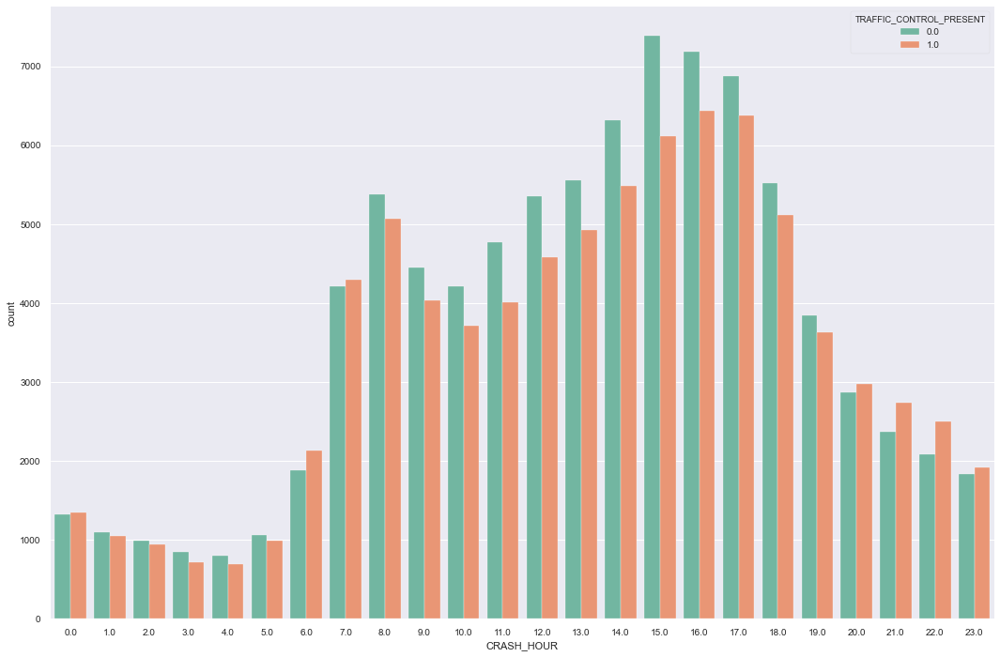
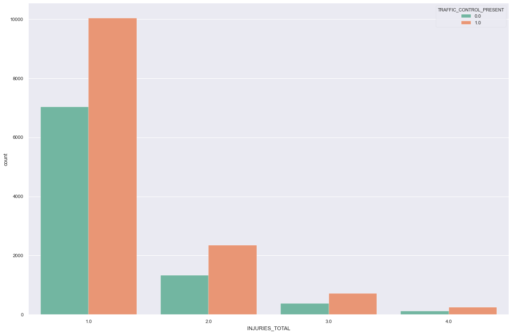
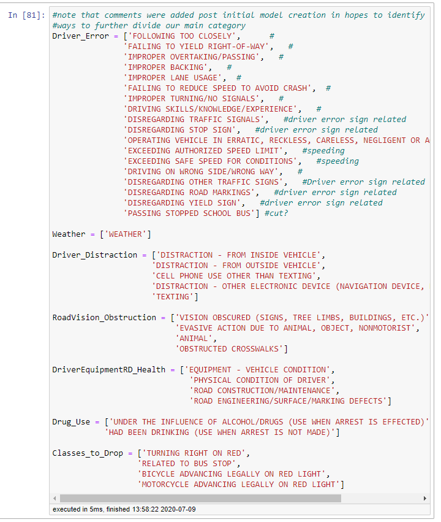
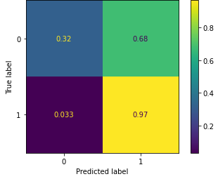
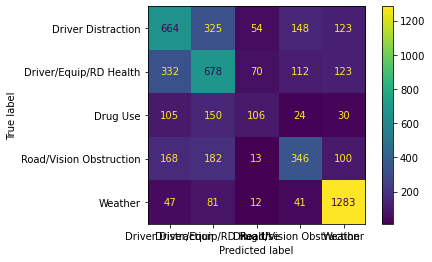

# Investigating Chicago Auto Incidents

Presentables

[Presentation](./Investigating_Chicago_Auto_Incidents-Final.pdf)
[Presentation Video](https://youtu.be/U4eWXZw8A2I)

[Relevant Blog](https://medium.com/@pchadrow/the-inaccuracy-of-accuracy-80ca3db39137)

## Purpose
Build comfortability with larger, complex datasets, and identify key factors to crash identification based upon Chicago Traffic data. This README shall briefly explain the process and steps taken throughout the project. 

## Data Used

All data was downloaded for project on July 5, 2020
[Primary Crash Data](https://data.cityofchicago.org/Transportation/Traffic-Crashes-Crashes/85ca-t3if)
[People Involved Data](https://data.cityofchicago.org/Transportation/Traffic-Crashes-People/u6pd-qa9d)
[Vehicles Involved Data](https://data.cityofchicago.org/Transportation/Traffic-Crashes-Vehicles/68nd-jvt3)

## Synopsis

During initial overview of data, it was easy to determine that I had more data than I could feasibly work with, clean, and produce a working model within a week. Due to this realization, I chose to soley focus upon the Primary Crash Data which required a fair amount of cleaning and maintence before any meaningful insights could be made from the data. Binning the types of crash classification did seem to impose a greater class imbalance. Due to this, an initial binary classification model was made to identify our prominent class from our remaining classes. While having a high accuracy score, the model proved to be overly bias in its classification. A multiclass model was made to identify the remaining classes which, unfortunately, only performed slightly better than random chance. With the class imbalance and large number of categorical features, determining specific feature importance was a fruitless task at this point in time. 

## Analysis

An initial [overview](./Data_exploration/Data_import_overview.ipynb) provided an excellent [profile report](./Data_exploration/Profile_Reports/crash_data.html) of the data. From there it was easy to identify the columns that needed work before exploration could begin. The notebooks within the Data_exploration folder show the cleaning process and an [attempt at filling some missing data](./Data_exploration/Attempt_at_filling_missing_lane_info.ipynb). Due to time constraints and a poor initial model, this idea was dismissed. However, I would like to return to this attempt and try semi-supervised learning to determine the missing values. 

____________________________________

After cleaning and feature engineering, I began to investigate the data in the Mapping_and_visualizations folder. The created maps are viewable as html files to reduce the size and improve the functionality of the [notebook](./Data_exploration/Mapping_and_visualizations\Mapping_crashes.ipynb). Visualization and further investigation was conducted in the [EDA notebook](./Data_exploration/Mapping_and_visualizations/EDA.ipynb). This investigation did identify the frequency of accidents seemining to align with a typical work day. 

This also showed an interesting trend of more accidents occuring in areas where traffic control was not present. When looking at injuries, however, we see that more occurred in areas where traffic control WAS present. 

This was an interesting disparity that I feel warrants further investigation given more time.
* What types of traffic control have more injuries associated with them?
* Are there ways of improving existing traffic control devices or areas that should have them but don't?
* Are there specific intersections or roads that result in more accidents/injuries than others? If so, is this due to lack of or poor traffic control?

______________________________
### Classification
After investigating the data, I began modeling and working towards classifying the primary causes of accidents. This was a multi-class problem. I attempt to simplify this issue in the [Creating_Crash_Master](./Data_exploration/Creating_Crash_Master.ipynb) notebook by grouping similar causes into larger categories for classification. 

This effectively took our number of classes down from 40 to 6. However, this also created and emphasized a class imbalance problem that would prove difficult to overcome. Given more time, this was something I wanted to try and break up further and import more unique features from missing datasets. 

Due to the class imbalance problem, we had 90% of data accounting for the Driver Error class while the other 5 classes made up the remaining 10%. My first model would be a binary classifier to see if we could easily identify something as being Driver Error or not (granted, Driver Error is a broad category and I still feel my grouping of the class leaves much to be desired). This model would give me high accuracy at identifying Driver Error, but would be a very biased model with a very high rate of False Positive identification. 

After creating the initial binary model, I then created a multi-class model to try and identify the remaining the classes from the data. My model seemed to work well when identifying if something was weather related, but the other classes were not much better than random chance.

## Conclusion 

Overall, the city of Chicago is doing well in terms of auto safety. Fatal car accidents are extremely low and the vast majority of accidents result in zero injuries. The issue of traffic control is still something I believe is worth looking into to improve safety even further. I believe there is a strong possibility that there are some areas without traffic control that could use some as well as room for improvement to some existing traffic control areas. 

The current state of the classification models isn't horrible, but still leaves a lot to be desired. The main hurdle is overcoming the class imbalance which is something I believe can be accomplished by having more features from the unused data sets and by refining the groupings of our classes. This is something that is vitally important to accomplish before we can really look at feature importances and trends among accident causes. 

